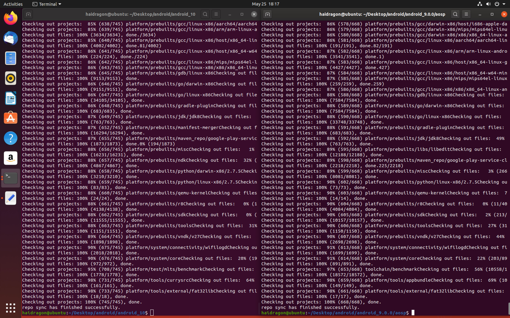
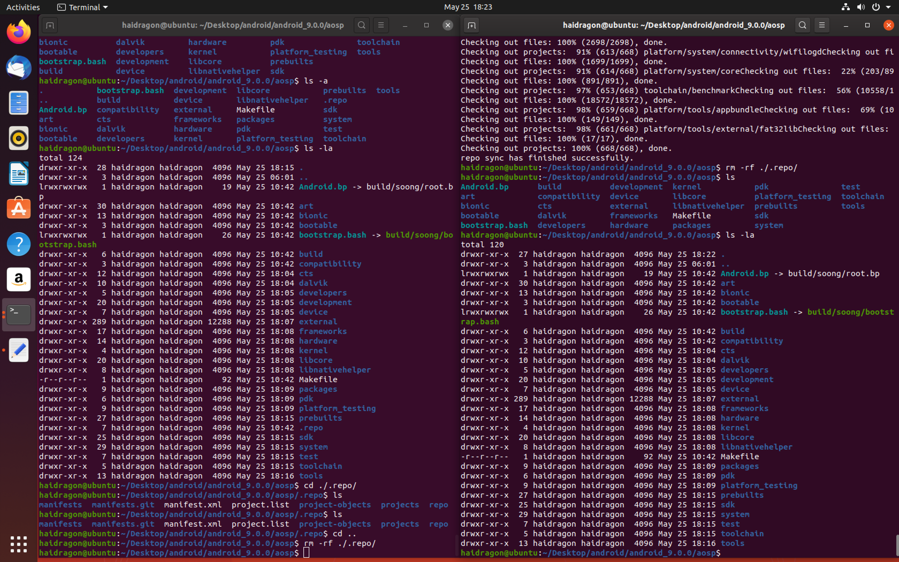
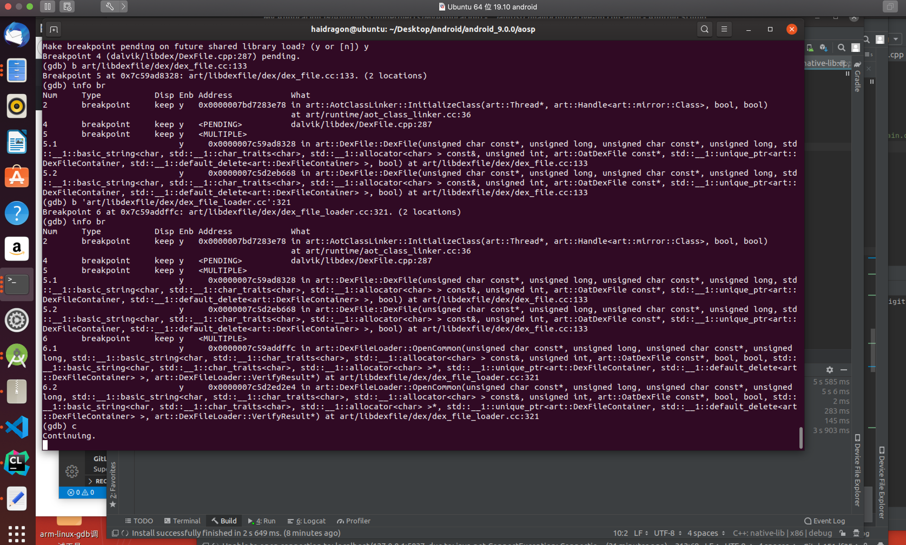
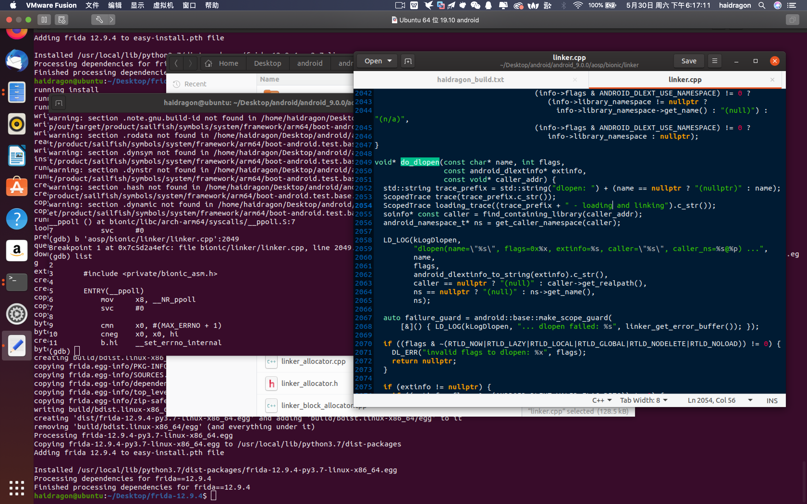
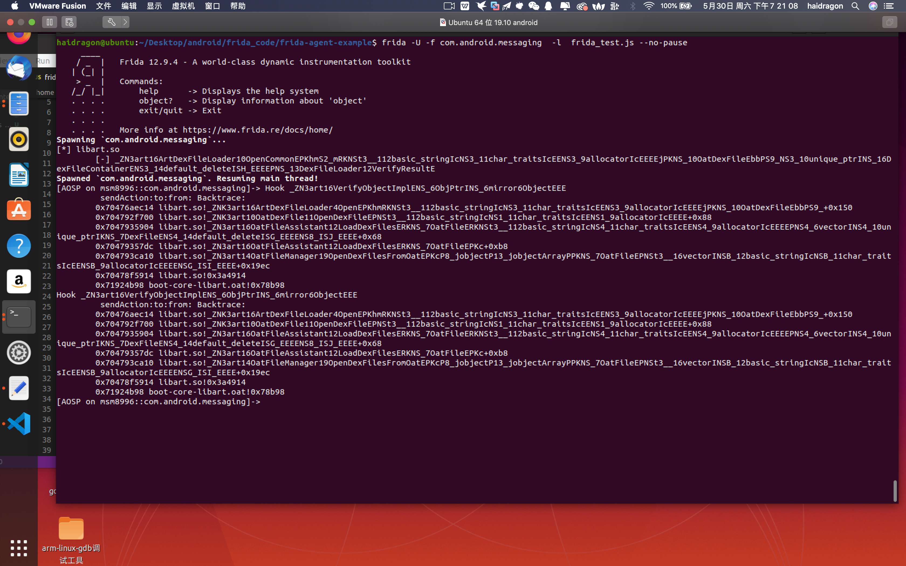

# study_learn_environment
学习中的一些各种环境问题
* 链接: https://pan.baidu.com/s/1URWg41KfpkMXYx7SESTzZQ  
## android 相关环境 
* android 4.4.4 ubuntu19.10 (展开80g左右）
* android 8.0   ubuntu19.10 (展开180g左右）
* android 10.0  ubuntu19.10 (展开213g左右）
* android 9编译 pixel 和android10未编译环境  ubuntu19.10 (展开300g左右）
* android8 pixel pixel xl编译完成环境       ubuntu19.10 (展开250g左右）
* android9.0 未编译源码和10.0未编译源码环境     ubuntu19.10 (270g左右）
* android9.0 frida ART虚拟机调试环境和10.0未编译源码环境     ubuntu19.10 (400g左右）
# 一些效果图片

 
# 由于容易被和谐，提取码联系作者，vx2207344074,备注(各种编译环境).
# 教程 请看 https://github.com/haidragon/study_Android_Mchange
